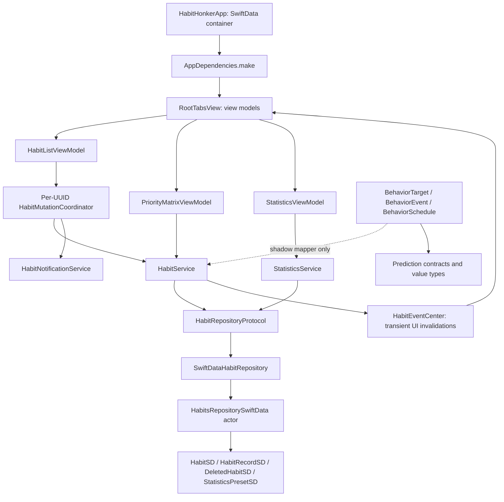
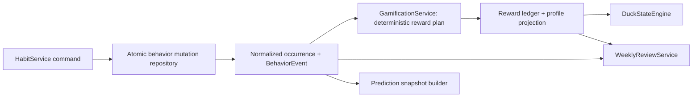

# Gamification / Behavior Tracking architecture investigation

Investigated 2026-09-20 against `153320c`. Documentation only: no production code, tests, assets, or project settings changed. Existing mutation-concurrency fixes are present. Source inspection, caller searches, asset inventory, and numerical checks inform this proposal; existing tests were inspected, not rerun for this documentation-only pass.

## 1. Current architecture map

Key observations:

- [AppDependencies.make][di] is already the composition root. Services consume protocols and can be injected into tests. The fallback construction in [RootTabsView.init][root] duplicates wiring and must receive the same future dependencies.
- [HabitModel][model] is a SwiftUI-coupled value (`Color`). [BehaviorTarget][target] and [BehaviorEvent][event] are Foundation-only, Codable/Sendable domain values. Reuse these boundaries; do not introduce a competing generic “Task” entity or rename the app's habit model.
- [HabitEventCenter][eventcenter] is a Combine `PassthroughSubject` with no persistence. Its [HabitEvent enum][uievent] contains cases without target IDs, occurrence IDs, timestamps, or snapshots. It is suitable for refreshing views, not granting rewards.
- [HabitMutationCoordinator][coordinator] serializes Save/Delete/Complete through one list view model. It is not a global transaction manager, does not cover Matrix priority changes, and cannot coordinate devices.
- [PredictionContracts][prediction] already accept normalized behavior data independently of UI. There is no implemented prediction engine or persistent behavior event store. Shadow mapping is not currently called from live completion; the matching feature flags default off ([flags]).

## 2. Exact task-completion flow

### Current explicit completion paths

| Entry | Actual path and behavior |
|---|---|
| List “today” swipe checkmark | [HabitListView, line 37][list] → Task → `viewModel.habitCompleteWith(id:)`, line 41 |
| List “Not for today” swipe checkmark | Same file, lines 63–68 → same view-model method. Completion is allowed off schedule and before/after one-time due dates. |
| Repeating versus one-time | Both use exactly the same [view-model method][completeVM] → [HabitService.completeHabit][completeService]. No separate recurring-completion function. |
| Completed section | Shows items completed today; no reversal action was found. Tomorrow a one-time item is not globally marked complete: completion is checked per date. It can become actionable again on another day. |
| Details | [savedItem()][details] copies all existing records with edited form fields. Save creates/updates metadata; there is no completion or undo button. A stale Details submission can nevertheless replace record arrays through ordinary `saveHabit`/mapper upsert. Do not treat every Save as an award. |
| Priority matrix | [changePriorityFor][matrix] → `HabitService.changePriority`, which fetches and upserts the entire model. It does not intentionally complete anything, but can write records incidentally. It is outside the list's mutation queue. |
| Statistics | [StatisticsViewModel][statsVM] selects/filter-loads habits and rebuilds a calendar. No record editing, check-off, or undo API was found. |
| Notifications | [HabitNotificationService][notifications] sets `habitID` in userInfo and schedules requests. No registered completion actions, `UNNotificationResponse` handler, or active delegate completion route exists. |
| Sync | SwiftData/CloudKit imports can alter persisted records without calling HabitService or publishing HabitEvent. There is no app-level imported-completion processing path. |

The exact local mutation is:

1. [HabitListViewModel.habitCompleteWith][completeVM] owns the UUID slot before calling the service.
2. [HabitService.completeHabit][completeService] fetches the latest model, calls `completeHabitNow`, then upserts and sends `.completed` after success.
3. [HabitModel.completeHabitNow][model], lines 25–43, reads `Date()` and `Calendar.current`. Existing same-local-day record: increment count. Otherwise append a record with a random UUID, completion timestamp, and count 1. Subsequent counts do not update that timestamp.
4. [SwiftDataHabitRepository.upsert][adapter] forwards to the repository actor.
5. [HabitsRepositorySwiftData.upsert][upsert] creates a context, fetches by UUID, applies/inserts, calls `ctx.save()`. [HabitMapper.apply][mapper] replaces the record collection with newly instantiated SwiftData objects while preserving each domain record UUID.
6. The view model updates memory from the service's persisted result. The transient event causes list/statistics reloads.

**Safest local semantic integration point:** `HabitService.completeHabit(id:)`. All explicit completion UI currently converges there. However, adding `await gamification.award()` after its current upsert is unsafe: a crash between commits would separate completion and reward. The service should instead request an atomic behavior-completion transaction (section 8), and publish UI invalidation only after that transaction commits.

**There is no single current point covering all durable changes:** sync imports bypass the service; Details saves and priority edits upsert record arrays; repository save/update/upsert can also persist records directly. Future integration must (a) use the service transaction for explicit completion, (b) prevent metadata edits from unintentionally rewriting authoritative completion state, and (c) reconcile imported/new behavior records through the same idempotent reward rules. Do not award from arbitrary `upsert` calls.

**Reversal:** no uncomplete/revert operation exists in the model, service protocol, UI, or behavior-event enum. Add an explicit occurrence-aware reversal command through HabitService and the transaction repository. It must identify the completion being undone. Deletion, archive, ordinary edits, and missing relationships must not implicitly reverse rewards. Decrementing a daily count from 2 to 1 is not equivalent to undoing an occurrence's completed status; this requires a policy decision.

## 3. Exact persistence model relevant to gamification

| Existing source / symbol | Stored information / limitation |
|---|---|
| [HabitItemSD.swift: HabitSD][sd] | UUID, icon string, color hex, title, description, tags, raw priority/type, selected weekday integers, dueDate, notification flag, optional records relationship with cascade deletion. No creation/activation timestamp, timezone, schedule history, or completion state field. |
| Same file: `HabitRecordSD`, line 60 | UUID, date, count; optional inverse links to active or deleted habit. No scheduled date, event transition, priority snapshot, reversal identity, or reward metadata. |
| [HabitModel.HabitRecord][model], line 72 | UI/domain-facing equivalent of UUID/date/count. A daily aggregate, not an immutable action event. |
| [DeletedHabitSD][deleted] | Copies the habit's current fields and records plus `deletedAt`. Records relation is nullify, not reward history. Permanent purge can remove the historical task context. |
| [HabitMapper][mapper], lines 65, 91, 120, 144, 174 | Converts active/create/update/archive/reload models. It copies current metadata, not historical-at-completion metadata. |
| [HabitsRepositorySwiftData][repo], lines 20, 60, 75, 98, 159, 180, 261 | One actor; fresh ModelContext per operation; autosave disabled; explicit save. Delete inserts archive and deletes active row in one save. Restore recreates active row; purge deletes archive. |
| [SwiftDataHabitRepository][adapter] / [HabitRepositoryProtocol][repoProtocol] | Protocol boundary and async adapter. Separate calls do not share a ModelContext transaction. |
| [StatisticsPresetSD][preset] | UUID/name/isActive/habitIDs only; selection preferences, not aggregated statistics or weekly snapshots. |
| [StatisticsService][statsService] | Resolves selected IDs from active rows, then deleted rows. Statistics are computed from current record collections. |
| [HabitHonkerApp][app], lines 18, 50–95 | Explicit four-model Schema; constructs local/default or named Cloud configuration; rebuilds dependencies on container change. Silent in-memory fallback exists if containers fail. Do not treat that fallback as durable reward storage. |
| [SyncManager][sync] / [entitlements][entitlements] | `syncOn` preference and CloudKit account availability; private container `iCloud.com.flyingwhale.habithonker`. This helper does not implement conflict handling, import processing, or merge transactions. |
| [UserDefaultsStore][defaults] / [BackgroundService][background] | UI preferences/theme and background image storage, not suitable for durable balances or ledger idempotency. |

No `VersionedSchema`, `SchemaMigrationPlan`, explicit model-version migration, or behavior-history migration was found. Cloud configuration is explicit; the default “local” `ModelConfiguration(for:)` path does not explicitly set CloudKit to `.none`, so future migration must inspect actual configuration/store URLs rather than assume toggling sync switches or migrates one shared database. There is no data-copy protocol between the named configurations in current code.

### Recurrence, occurrence identity, statistics

- Recurrence is [HabitType.repeating + Set<Weekday>][model]; Sunday=1...Saturday=7 ([weekdays]). `dueDate` is an absolute timestamp for one-time tasks and doubles as notification time for repeating habits. It is not a persisted repeating start date or scheduled-occurrence timestamp.
- [HabitSortFilterService][filter], lines 36–78, compares current selected weekdays or same-day due date, then excludes `isCompleted(on:)`. `isCompleted` checks record existence for the queried local day, even if count is zero.
- There are no persisted scheduled, missed, skipped, or streak entities/calculators. A missing record alone does not prove a miss: the habit might not have existed, might have had different weekdays, or could have been inactive.
- [CalendarBuilder.indexRecordsByDay][calendar], line 111, buckets record timestamps by current local start-of-day, adds counts per habit/day, and uses the habit's **current** color. `pillsForDate`, line 91, displays `max(1, min(count, 4))` pills. It does not enumerate scheduled days or show a trustworthy completion-rate denominator. Its initializer overrides the supplied calendar timezone with `.current`.
- Stable daily occurrence ID: **none**. Random record UUIDs persist locally but two offline devices can generate different record IDs for the same logical day. `DayItem`/`Pill` UUIDs are presentation identities and regenerate.
- The shadow mapper maps a mutable daily record to a `.completed(count:)` BehaviorEvent with the same record ID. That mapping is useful as legacy analytics input, but it is not one event per completion or a reward idempotency key.

**Reuse without duplicating truth:** keep existing records/statistics for compatibility. Introduce an occurrence-level domain because the daily count cannot hold missing schedules or historical context. New occurrence state becomes authoritative for reward eligibility; the old records become an explicitly maintained compatibility projection during migration. Link to the legacy record ID and label imported data quality. Do not independently dual-edit both histories forever. Existing historical priority, recurrence, notification state, later intra-day completion timestamps, and streaks cannot be reconstructed accurately—leave unknown rather than copying current settings as historical facts.

## 4. Recommended Gamification architecture

Keep mutable HabitSD as the task source of truth. Task commands are not rebuilt by replaying events. Only reward/currency history uses an append-only ledger; behavior observations and schedule snapshots are supporting analytics, not an event-sourced application.

Use the existing pure Behavior types. Extend event payloads to identify an occurrence, transition, reward-input snapshot, and schema/source quality. Preserve the existing mapper as an explicitly legacy conversion; new live events come from the transaction, not by repeatedly scanning counts and interpreting each count as XP.

GamificationService produces a deterministic plan from normalized behavior and prior reward state. It does not import SwiftUI, SwiftData, Combine, CloudKit, or prediction contracts. Its plan is applied atomically by the persistence boundary; it must not own a second independent `save()` after task completion. Prediction reads occurrences/events directly through a read protocol, never through rewards, mood, or a GamificationService callback.

## 5. Proposed models

| Model | Proposed fields / semantics |
|---|---|
| `TaskOccurrence` | Stable string ID, BehaviorTargetID, scheduled local date, planned start/due instant when known, fixed calendar/timezone policy, task type, status, completion timestamp/count, selected weekdays and schedule-revision ID, priority/icon/reminder snapshots, local completion hour and timezone, streak before/after when known, eligibility, legacy record ID, provenance, schemaVersion, predecessor/alias ID for intentional conversion. No XP/coins. Missing/unknown is distinct from false. |
| `BehaviorScheduleRevision` | Stable revision ID, target ID, effectiveFrom/effectiveTo, activation start/end, schedule, timezone/calendar, priority/icon/reminder metadata snapshot. Needed to generate historical scheduled/missed occurrences after long absences. Captured on edits and priority changes; not retroactively recomputed from today's habit. |
| Extended `BehaviorEvent` | Existing target/time/kind plus occurrenceID, stable command/transition ID, predecessor transition ID, source, snapshot/version. Add explicit reversal/skip kinds where needed. Count remains analytics, not number of rewards. |
| `GamificationProfile` | Logical profile ID, net totalXP for progression, derived level/cache version, honkerCoins, lifetimeCoinsEarned/Spent, optional gross lifetimeXPEarned, lastProcessedWeek hint, trackingStartedAt, fixed week policy/timezone, schemaVersion, aggregate fingerprint, updatedAt. Balances are projections, not mergeable counter increments. Never reset XP when leveling. |
| `GamificationLedgerEntry` | Physical ID plus logical business key, profileID, event/transition ID, sourceTaskID scalar UUID, occurrenceID, signed xpDelta/coinDelta, reason, original/reversal linkage, reward input snapshot, policyVersion, createdAt, schemaVersion. No cascade dependency on HabitSD. Original entries remain unchanged. |
| `WeeklyGamificationSnapshot` | Stable week key; explicit timezone/calendar/start/end; all requested counts/rates, XP/coin earnings excluding own weekly bonus, best streak, priority counts, ranked IDs and frozen display labels, at-risk IDs with explanation rules, mood/reaction keys, summary template/arguments/rendered locale text, source fingerprint, capturedAt, version, final/provisional status. Immutable revisions, not overwrite-in-place. |
| `DuckState` | Mood, activity, assetKey, reactionKey, explanationCode and policyVersion. Pure output from supplied stats and `now`; no simulation stats or new currencies. |

All new persistent entities need optional/defaulted CloudKit-compatible fields. Keep ledger/source IDs as scalars, not cascading relationships. Store enum raw values with versioned decoding. A profile is one **logical** account/profile even if sync creates duplicate physical rows.

Lifetime terminology needs agreement: reward reversal must reduce progression XP, while a gross “ever earned” statistic can remain monotonic. Recommended `totalXP = signed ledger sum` for level; optional `lifetimeXPEarned` reports gross earnings. Never call both the same quantity. Likewise distinguish spending from reversal adjustments in coin totals. If coins were spent before a reversal, do not silently clamp the balance and create money; either track debt or disallow spending against provisional rewards. V1 has no purchase implementation here.

## 6. Proposed services and deterministic balance policy

- `RewardCalculator`: pure calculation from a frozen occurrence, prior eligible streak, policy version. No clock, queries, or current mutable HabitModel.
- `LevelCalculator`: pure cumulative threshold mapping; no XP consumption on level-up.
- `GamificationService`: pure reward/compensation plan from an explicit normalized transition and ledger projection; no hidden global state.
- `OccurrencePlanner` / `OccurrenceIdentity`: deterministic schedule enumeration, occurrence keys, eligibility and streak calculation with injected calendar/time policy.
- `WeeklyReviewService`: repository-backed closed-week catch-up; uses a pure weekly reward calculation and atomic snapshot/bonus commit.
- `BehaviorReconciliationService`: resumable imported/history reconciliation, logical-key deduplication and profile rebuild; no reward side effects from UI publisher subscriptions.
- `DuckStateEngine`: pure mood/activity/key derivation; weekly review may ask it for the week's reaction. No prediction dependency.

### Exact proposed reward calculation

Use integer/rational multipliers (e.g. hundredths), checked integer arithmetic and **one** final rounding step. Proposed XP rounding: nearest integer, halves upward; this is a product choice missing from the input specification.

`XP = roundHalfUp(baseXP × priorityMultiplier × streakMultiplier × onTimeMultiplier)`.

| Type / priority | Values |
|---|---|
| Repeating / one-time base | 25 XP + 3 HC / 40 XP + 5 HC |
| Important, not urgent | XP ×1.30; +2 HC |
| Important, urgent | XP ×1.20; +1 HC |
| Not important, urgent | XP ×1.10; +0 HC |
| Neither | XP ×1.00; +0 HC |
| Repeating streak after completion 1 / 2–3 / 4–6 / 7–13 / 14–29 / 30+ | ×1.00 / 1.05 / 1.10 / 1.15 / 1.20 / 1.25 |
| On time | ×1.10 if repeating completion is on assigned scheduled local date, or one-time `completedAt <= dueAt`; otherwise ×1 |

One-time tasks use streak multiplier 1 and no streak milestones. Coins are base + priority bonus + applicable repeating streak milestone, not multiplied by XP factors. Milestones 3/7/14/30/60/100 add 2/5/8/15/25/50 HC respectively, once per eligible milestone in a streak run. A reversal references the original grant, including that milestone, rather than recalculating against current streak rules. Recompletion restores the original reward entitlement; it must not farm another milestone.

Proposed streak: consecutive **scheduled** occurrences completed, ignoring unselected weekdays. Define skipped-day treatment explicitly (recommended exclude denominator and pause streak, but confirm). Late and off-schedule completion assignment is unresolved; do not infer it from record.date. Misses grant zero and never subtract balances.

Example: first, on-time important/not-urgent repeating occurrence → `25×1.30×1×1.10 = 35.75` → **36 XP, 5 HC**. On-time important/urgent one-time → `40×1.20×1.10 = 52.8` → **53 XP, 6 HC**. Historic reward input and rounded output are persisted once.

### Level curve checked

`threshold(L) = 5 × floor((80 + 20(L−1) + 2(L−1)^1.6)/5 + 0.5)` for L≥1.

| L | Rounded XP to next level |
|---|---:|
| 1 | 80 |
| 2 | 100 |
| 3 | 125 |
| 5 | 180 |
| 10 | 325 |
| 20 | 680 |
| 30 | 1095 |
| 40 | 1565 |
| 50 | 2070 |

These match the supplied examples, independently evaluated in this investigation. Level is `1 + number of cumulative thresholds reached`; e.g. 79 XP→L1, 80→L2, 180→L3. Use a versioned threshold table or specified numerical/rounding implementation for cross-platform consistency, with overflow/range checks. Reversal can lower derived level; do not irreversibly cache the highest level as the current level.

## 7. Event flow

**Completion:** explicit command (target, occurrence, command ID, captured now) → service → transaction fetches latest task and occurrence → normalized transition/snapshot → GamificationService plan → task/compatibility record + occurrence + BehaviorEvent + ledger + profile written in one local save → publish existing `.completed` invalidation → UI reads profile/duck state.

**Repeated checkmark:** existing app increments daily counts, including repeated calls. Preserve count analytics if desired, but grant once per logical occurrence. A lifecycle retry carries the same command ID; a new deliberate count increment has a new command ID but still no additional occurrence reward. One-time reward eligibility is lifetime-per-task-occurrence, not every day the task is tapped.

**Reversal:** explicit target completion transition → validate current state → append compensation using original deltas → update occurrence/compatibility projection/profile atomically → retain original reward rows. Completion after reversal references that reversal and restores entitlement once. Metadata save, creation, opening the app, deletion and schedule regeneration grant nothing.

**Imported data:** imports do not publish the service's live command. Reconciler reads durable normalized data or explicitly tagged legacy rows, waits for necessary referenced snapshots, and applies logical-key rules. Missing relationships during sync are not uncompletion commands. Never try to infer a reward reversal from disappearance alone.

## 8. Persistence / migration and transaction strategy

### Local atomicity

Extend [HabitsRepositorySwiftData][repo] with an atomic behavior-mutation method using **one context and one `ctx.save()`**. Its current `makeContext()`/explicit-save pattern is the appropriate anchor. Add a protocol for this operation, forwarded by the existing adapter. Inside the actor, synchronously load the task, occurrence, prior logical reward keys and profile; call a pure reward planner; mutate all entities; save once; rollback/discard the context on failure. Do not await another repository or service between loading and committing.

A new synchronous `BehaviorTransactionSD` helper can encapsulate the mapping/planning inside that method; the actor supplies its context. This avoids granting a second repository an independent context and falsely calling two commits a transaction. It also serializes profile aggregation across **different habit UUIDs**, which share one balance. The list's per-ID queue still surrounds notification/UI work; it does not protect account-wide counters by itself.

Crash before save: no committed completion/reward bundle. Crash after save but before UI publication: durable keys make retry return the same result. Failure must be returned, not swallowed. If later external reward authority is introduced, commit a durable pending command with completion and process it idempotently; local SwiftData and a remote authority cannot form a single database transaction. Distinguish provisional from confirmed rewards.

Metadata save/priority changes must preserve latest authoritative history and record effective metadata revisions within the same repository boundary. In particular [HabitMapper.apply][mapper] currently replaces records; continuing that unrestricted behavior would let a stale draft contradict the new reward history. This is a necessary narrow edit-policy change, not a broad application rewrite. Archive records preserve reward evidence via independent scalar-linked entities; task deletion closes future eligibility but does not delete ledger history or penalize completed work.

### Migration

1. Inventory actual current store/configuration URLs and deployed CloudKit schema. Preserve fixtures from the current four-model schema.
2. Introduce versioned schemas/migration plan anchored in [HabitHonkerApp's Schema construction][app]. Keep existing model names/IDs/relationships compatible; test migrations on copies before release.
3. Add new behavior/gamification entities with compatible defaults. Store tracking activation date and persisted calendar/timezone policy. Do not assume the earliest observed completion equals task creation date.
4. Import legacy daily records as provenance-tagged aggregates. Preserve record UUID linkage and count. Deduplicate logical target/day where evidence permits; unresolved timezone/duplicate conflicts remain unknown. Do not fabricate historical schedules, priority, exact per-tap times, or misses.
5. Recommended default: **no retroactive XP** for pre-enrollment history, and no old-week bonus catch-up before trackingStartedAt. Import for statistics/prediction with confidence tags. Retroactive rewards require an explicit separate policy and migration key.
6. Run transaction/ledger writes in shadow-validation mode with flags before exposing balances. Gate reward persistence off for the current in-memory fallback; surface storage failure rather than show durable-looking earnings.

Apple documents that CloudKit-backed SwiftData does not support unique constraints and that relationship changes are not guaranteed atomic across sync. A local multi-entity commit is therefore not a global multi-device transaction. [Apple: syncing model data](https://developer.apple.com/documentation/swiftdata/syncing-model-data-across-a-persons-devices). Validate the precise shipping SDK/schema through migration tests rather than applying a local `@Attribute(.unique)` fix to a synced store.

## 9. Idempotency strategy

### Occurrence identities

Use a canonical **stored string**, not Swift's randomized `Hasher`:

- One-time: `occ:v1:<taskUUID>:once`. Editing its due date must not mint another reward.
- Repeating: `occ:v1:<taskUUID>:day:<YYYY-MM-DD>` under the task's persisted scheduling calendar/timezone. Gregorian is the proposed V1 identity calendar; locale only changes display.
- Schedule revisions affect frozen input, not the day key. Removing/re-adding a weekday, notification changes, title changes, relaunch, or regeneration must reuse the same occurrence identity.
- Store actual date interval instants and timezone alongside the civil date for DST and travel analysis. Never recompute old keys using the device's new timezone. Timezone-policy changes need explicit effective-date handling.
- Type conversion after completion needs an explicit occurrence-preserving alias/migration rule, or restriction until history is closed. Blindly switching `once`/`day` namespaces can create a second reward for the same work. Do not enable conversion rewards without that policy.

### Durable reward keys and reversals

Use logical profile key `profile:v1:default` within the private CloudKit account/container namespace, not a newly generated profile UUID per device. A local-only store keeps a persisted store namespace; opting into cloud requires an explicit merge/adoption policy so local and cloud history do not become two separately rewarded profiles. Do not use an Apple ID email as an identifier. Calendar/timezone enrollment settings must converge to one canonical profile policy before devices generate confirmed occurrence identities; a local device timezone alone is insufficient.

Separate physical entity IDs, retried command IDs, and logical entitlement IDs. Initial completion reward key: `reward:v1:<profileID>:<occurrenceID>:initial`. Persist a processed command receipt/transition in BehaviorEventSD in the same transaction. Repeated delivery or new same-occurrence count cannot create another initial entitlement. **Policy version belongs in the payload, not a new entitlement namespace that re-awards after an app update.**

A reversal key references the exact grant: `reverse:<grantKey>`. A restore key references the exact accepted reversal: `restore:<reversalKey>`. Only accept a transition from the expected predecessor; repeated requests for that state are no-ops. Local completion→reverse→restore yields `+R, −R, +R`: net one reward, full history retained. Reversals negate historical amounts even after priority/policy edits. Use the original reward basis for restores. A future legitimate second reversal targets the restore grant, not the already-reversed original.

Weekly bonus has its own `weeklyBonus:v1:<profileID>:<weekKey>` key. A rebuilt aggregate folds **distinct logical keys**, never raw physical row counts and never summed device-level profile balances.

### What can and cannot be guaranteed with current sync

Durable-key checks plus one actor transaction guarantee local idempotency across retries and relaunch. Across two offline devices, identical logical keys may be inserted as separate physical SwiftData rows. Project balance from a keyed set and deterministic conflict resolution, not blindly appending both deltas, so duplicate logical awards are not counted twice once observed. Profile is a rebuildable cache with a source fingerprint; CloudKit last-writer profile values are not authoritative.

However, offline devices can disagree about snapshots, completion/reversal predecessor order, and coin spending. A logical key does **not** prevent two devices accepting incompatible transitions before sync. Selecting a deterministic winning payload later provides convergence, not linearizable exactly-once acceptance or guaranteed never-changing confirmed balances. Do not hide this limitation behind an in-memory flag or a random event UUID.

**Strict requirement decision:** if “impossible to double grant” includes global confirmed issuance and spending under concurrent offline edits, stock automatic SwiftData/CloudKit mirroring is insufficient. Use a serialized authoritative reward endpoint, or a dedicated CloudKit record-zone protocol with deterministic record IDs, conditional writes, conflict retries, and atomic same-zone state changes; offline rewards remain pending until accepted. Apple exposes same-zone atomic operations and conditional save policies, but that would be an additional explicit reward persistence adapter, not an ability supplied by the current app. [Apple: atomic zone capability](https://developer.apple.com/documentation/cloudkit/ckrecordzone/capabilities-swift.struct/atomic), [Apple: record modification](https://developer.apple.com/documentation/cloudkit/ckdatabase/modifyrecords(saving:deleting:savepolicy:atomically:completionhandler:)).

Recommendation: choose that guarantee before implementation. A minimal local/provisional V1 can use the existing container plus deduplicated projections, but **must not be represented as satisfying strict globally exclusive multi-device rewards**. A full cloud-authority file list cannot honestly be finalized until its provider is selected. No authority or sync rewrite is implemented/proposed as an automatic default in this pass.

## 10. Weekly snapshot strategy

### Lifecycle integration

[RootTabsView.task][rootTask], lines 95–101, already runs authorization, appearance and initial load after dependencies exist. Add an awaited service call there **after behavior reconciliation**, not in `HabitListViewModel.onAppLaunch` (currently notification authorization only). Add `scenePhase` observation in RootTabsView for active transitions; none exists today. The view forwards a trigger to `WeeklyReviewService.ensureMissingSnapshotsGenerated(now:)`; calculations/storage remain in services. Repeated foreground triggers must be coalesced locally and idempotent durably.

[HabitHonkerApp.rebuildContainerIfNeeded][app] recreates dependencies. A new service must bind to that container/profile scope, cancel obsolete workers or ignore their results, and never apply a snapshot to a replacement account/store. Account availability is not evidence that sync has finished. BGTask, if introduced later, calls the identical service and is opportunistic only.

### Closed-week algorithm

Persist a week policy (proposed Monday 00:00 to next Monday 00:00, Gregorian, fixed profile timezone) and use calendar additions, never seven×24-hour seconds. Half-open intervals `[start,end)` remove boundary ambiguity. Starting at trackingStartedAt, enumerate every week with `end <= now`; for each, look up the logical snapshot/bonus key. `lastProcessedWeek` is only a speed hint—holes are discovered and filled.

Generate the denominator from effective schedule revisions and persisted occurrences, including tasks deleted after their scheduled work. Do not use only current active habits, the statistics selection preset, or completed records. Recommended eligible set: scheduled obligations while active during the week; exclude explicitly skipped/cancelled-future obligations, include eligible misses. Off-schedule work can be logged without silently increasing the eligible-completion numerator above the denominator. Start-of-tracking partial week eligibility needs a documented rule.

Snapshot and bonus ledger entry/profile update commit atomically. Concurrent foreground calls cannot duplicate either. Zero denominator: rate is unavailable, not automatically 100%; fewer than five eligible occurrences: no bonus.

Use exact count ratios rather than rounded display percentages:

| Completion rate (N≥5) | Proposed bonus before XP cap |
|---|---|
| `<0.60` | 0 XP / 0 HC |
| `>=0.60, <0.75` | 40 XP / 5 HC |
| `>=0.75, <0.90` | 80 XP / 10 HC |
| `>=0.90, <1` | 140 XP / 20 HC |
| `1` | 200 XP / 30 HC |

`weeklyXP = min(tierXP, floor(eligibleCompletionXPForWeek / 4))`. Do not round upward past the 25% cap. Coins are not capped by this XP rule. Exclude weekly bonuses and future spending from the completion XP basis; define reversal-adjusted completion XP explicitly. Example: five ordinary on-time repeating completions at 28 XP each = 140 completion XP; a perfect week grants **35 bonus XP and 30 HC**, not 200 XP. Whether “during that week” means occurrence week or completion timestamp must be finalized; recommendation uses completion timestamps for earnings and scheduled dates for the completion-rate denominator, with both stored separately.

**Immutable versus late sync:** a week being calendar-closed does not mean every device has uploaded. It is impossible to guarantee a globally complete immutable report immediately after close with unbounded offline devices. Recommended snapshots are immutable revisions: create the original once per week, then a new superseding revision with a source fingerprint if late input changes it. Retain old snapshots; apply append-only bonus adjustments against the original bonus key, never grant the whole bonus again. Alternatively freeze permanently and disclose late-data exclusion. The stricter interpretation of exactly one immutable row forever needs that product choice; do not silently overwrite the snapshot. Corrections are not penalties for missing tasks and must not retroactively reprice old task rewards.

## 11. Duck state / asset-key strategy

Icon source is `HabitModel.icon: String?`, persisted as `HabitSD.icon`, projected as `BehaviorTarget.iconName`. Selection uses [HabitDetailView.icons][icons] and its sheet tap handler at line 317. Assets are PDF image sets in [icons_for_user][assets]. No typed icon enum and no duck animation/key catalog were found.

Use an explicit versioned dictionary in DuckStateEngine (or a small private mapping within that file), with pure strings in/out:

| Verified current identifier | Activity |
|---|---|
| `biceps-flexed`, `weight`, `cyclist`, `basketball` | gym |
| `academic-cap`, `university-hat-simple` | study |
| `brand-github-fill`, `brand-github-mascot-fill` | coding |
| `passport`, `bill`, `print`, `attachment` | paperwork |
| `checklist`, `calendar-dates` | planning |
| `bed` | sleeping |
| nil, `empty_icon`, unknown identifier, all unmapped icons | idle |

The user's example `book`/`computer` IDs are not in the current picker. Do not add a title parser or pretend they are existing identifiers. Current icon is for current task reaction; historic weekly activity must use the frozen occurrence icon/activity mapping version so task edits do not rewrite a past reaction.

Suggested deterministic precedence, to be approved as product policy: weekly completion celebration → just-completed success reaction → explicitly provided local quiet-hours sleepy → recent-miss concern → focused/neutral fallback. “Annoyed” should not be selected without an approved rule; missing tasks must not alter balances. Derive moods from explicit counts/times; no random selection or wall-clock calls in the engine. Define tie-breaks for top activity/task using stable IDs.

Return keys such as `duck.gym.success`, `duck.coding.success`, `duck.weekly.perfect`, and guaranteed fallback `duck.idle.default`. These are **proposed semantic keys, not existing assets**. Future renderer maps keys to real assets and falls back safely. No asset work or new UI is required in this investigation.

## 12. Exact new-file plan

All paths below are proposed, not created. Keep pure concepts grouped initially to avoid one-file-per-field scaffolding. The local/provisional integration plan is explicit; strict remote authority is a separately gated extension (section 9).

| Proposed absolute file | New responsibility / reason |
|---|---|
| `/Users/Vlad/Development/habitHonker/HabitHonker/HabitHonker/Core/Domain/TaskOccurrence.swift` | Occurrence state, identity wrapper, eligibility/provenance and fixed time policy; new behavior domain, separate from rewards. |
| `/Users/Vlad/Development/habitHonker/HabitHonker/HabitHonker/Core/Domain/BehaviorScheduleRevision.swift` | Effective schedule/priority/icon/reminder history needed to enumerate past obligations. |
| `/Users/Vlad/Development/habitHonker/HabitHonker/HabitHonker/Core/Domain/GamificationModels.swift` | Profile, ledger entries, reward plans and typed logical keys without persistence frameworks. |
| `/Users/Vlad/Development/habitHonker/HabitHonker/HabitHonker/Core/Domain/WeeklyGamificationSnapshot.swift` | Immutable versioned report and week identity. |
| `/Users/Vlad/Development/habitHonker/HabitHonker/HabitHonker/Core/Domain/DuckState.swift` | Mood/activity/key value types only. |
| `/Users/Vlad/Development/habitHonker/HabitHonker/HabitHonker/Core/Behavior/OccurrenceIdentity.swift` | Canonical task/day or task/once keys; no randomized hashing. |
| `/Users/Vlad/Development/habitHonker/HabitHonker/HabitHonker/Core/Behavior/OccurrencePlanner.swift` | Calendar-based enumeration, explicit occurrence assignment and scheduled-occurrence streaks. |
| `/Users/Vlad/Development/habitHonker/HabitHonker/HabitHonker/Core/Gamification/GamificationPolicy.swift` | Versioned constants, rounding, eligibility and milestone policy. |
| `/Users/Vlad/Development/habitHonker/HabitHonker/HabitHonker/Core/Gamification/RewardCalculator.swift` | Pure task and weekly bonus arithmetic. |
| `/Users/Vlad/Development/habitHonker/HabitHonker/HabitHonker/Core/Gamification/LevelCalculator.swift` | Cumulative curve and level mapping. |
| `/Users/Vlad/Development/habitHonker/HabitHonker/HabitHonker/Core/Gamification/GamificationService.swift` | Pure normalized-transition to reward/compensation plan using supplied history. |
| `/Users/Vlad/Development/habitHonker/HabitHonker/HabitHonker/Core/Services/WeeklyReviewService.swift` | Closed-week catch-up orchestration through repository protocol. |
| `/Users/Vlad/Development/habitHonker/HabitHonker/HabitHonker/Core/Services/BehaviorReconciliationService.swift` | Resumable import/deduplication/projection reconciliation; separate from UI events. |
| `/Users/Vlad/Development/habitHonker/HabitHonker/HabitHonker/Core/Services/DuckStateEngine.swift` | Pure mood/activity/asset-key computation and explicit icon mapping. |
| `/Users/Vlad/Development/habitHonker/HabitHonker/HabitHonker/Core/Protocols/BehaviorTransactionRepositoryProtocol.swift` | Atomic completion/reversal commands with context-free input/result types. |
| `/Users/Vlad/Development/habitHonker/HabitHonker/HabitHonker/Core/Protocols/GamificationRepositoryProtocol.swift` | Read profile/history and atomically commit weekly snapshot/bonus; no ModelContext leaks. |
| `/Users/Vlad/Development/habitHonker/HabitHonker/HabitHonker/Core/Repositories/SwiftDataGamificationRepository.swift` | Forward gamification reads/weekly mutations to the same repository actor; no separate independent transaction. |
| `/Users/Vlad/Development/habitHonker/HabitHonker/HabitHonker/Repository/SwiftDataRepository/BehaviorSD.swift` | Occurrence, schedule-revision and normalized event/command-receipt storage. |
| `/Users/Vlad/Development/habitHonker/HabitHonker/HabitHonker/Repository/SwiftDataRepository/GamificationSD.swift` | Profile and append-only ledger storage, scalar task references. |
| `/Users/Vlad/Development/habitHonker/HabitHonker/HabitHonker/Repository/SwiftDataRepository/WeeklyGamificationSnapshotSD.swift` | Immutable report revisions with logical week key and source fingerprint. |
| `/Users/Vlad/Development/habitHonker/HabitHonker/HabitHonker/Repository/SwiftDataRepository/BehaviorTransactionSD.swift` | Synchronous transaction helper using context supplied by the existing actor; mapper and pure planner invocation. |
| `/Users/Vlad/Development/habitHonker/HabitHonker/HabitHonker/Repository/SwiftDataRepository/HabitSchemaMigration.swift` | Versioned schema declarations and tested migration plan. |

Proposed new test files in the existing test target (section 14 defines their contracts):

- `/Users/Vlad/Development/habitHonker/HabitHonker/HabitHonkerTests/RewardCalculatorTests.swift`
- `/Users/Vlad/Development/habitHonker/HabitHonker/HabitHonkerTests/LevelCalculatorTests.swift`
- `/Users/Vlad/Development/habitHonker/HabitHonker/HabitHonkerTests/GamificationServiceTests.swift`
- `/Users/Vlad/Development/habitHonker/HabitHonker/HabitHonkerTests/BehaviorTransactionTests.swift`
- `/Users/Vlad/Development/habitHonker/HabitHonker/HabitHonkerTests/OccurrenceIdentityTests.swift`
- `/Users/Vlad/Development/habitHonker/HabitHonker/HabitHonkerTests/WeeklyReviewServiceTests.swift`
- `/Users/Vlad/Development/habitHonker/HabitHonker/HabitHonkerTests/GamificationReconciliationTests.swift`
- `/Users/Vlad/Development/habitHonker/HabitHonker/HabitHonkerTests/GamificationMigrationTests.swift`
- `/Users/Vlad/Development/habitHonker/HabitHonker/HabitHonkerTests/DuckStateEngineTests.swift`

## 13. Exact existing-file modification plan

These are future changes only. Each entry identifies the current symbol, why it is the integration point, and its proposed responsibility. No other production files are required for the initial domain/storage integration; visible gamification UI and real asset files are a later pass.

| Existing file / symbol | Why here / proposed change |
|---|---|
| [AppDependencies.swift: make][di] | Existing composition root: construct pure policy/calculators/planner, pass planner into atomic repository setup, inject transaction/read repositories into HabitService and weekly/reconciliation services. Expose services as values/protocols, no singleton. |
| [HabitHonkerApp.swift: schema, rebuildContainerIfNeeded][app] | Owns all container construction: register schema/migration, initialize tracking/store identity, distinguish durable store from fallback, scope dependencies/workers to current container. |
| [RootTabsView.swift: init, task][root] | Receives dependencies and owns lifecycle: wire the existing fallback to the same service graph, call reconcile then weekly catch-up at launch/foreground. Add scenePhase trigger only; no reward logic in the view. |
| [HabitService.swift: completeHabit, saveHabit, changePriority, deleteHabit][completeService] | Single explicit completion entry: use atomic behavior command; add explicit reversal API; route edit/priority changes to metadata-preserving-history transactions and revision capture; close future occurrence eligibility on delete. Publish UI invalidations after commit. |
| [HabitServiceProtocol.swift][serviceProtocol] | Public domain service boundary: occurrence-aware completion/reversal input/results. Keep compatibility wrapper if needed for current UI callers. |
| [HabitRepositoryProtocol.swift][repoProtocol] | Clarify metadata-update versus whole-record upsert contracts so ordinary edits cannot rewrite authoritative completion history. Atomic behavior operation lives in separate narrow protocol, not as unrelated repository calls. |
| [SwiftDataHabitRepository.swift][adapter] | Existing repository adapter: forward atomic behavior operations to the shared actor and adapt revised metadata APIs. |
| [HabitsRepositorySwiftData.swift: makeContext/upsert/delete][repo] | Owns context/save: add single-context behavior transaction, schedule revisions on mutations, gamification reads and weekly atomic commit. Do not open a second actor with independent balance writes. |
| [HabitMapper.swift: apply][mapper] | Currently replaces all records from the supplied snapshot: support metadata-only writes and explicit completion projection mapping. Prevent stale Details/priority snapshots from erasing authoritative history. |
| [HabitModel.swift: completeHabitNow][model] | Currently reads hidden current clock/calendar: accept an explicit completion timestamp/calendar (defaults may preserve callers), or retire it from live persistence in favor of transaction command derivation. Preserve count UI semantics; add no reward fields. |
| [BehaviorEvent.swift][event] | Existing pure event vocabulary: add occurrence/transition/reversal/snapshot/provenance fields with compatibility policy; do not create a parallel Activity enum that duplicates it. |
| [HabitShadowMapper.swift][shadow] | Keep existing daily-count conversion explicitly legacy/analytics-only; map new occurrence snapshots to normalized behavior inputs without importing reward/prediction policy. |
| [FeatureFlags.swift][flags] | Add explicit gamification rollout/shadow flags. Existing event logging and prediction flags do not automatically authorize reward emission. |
| [HabitListViewModel.swift: habitCompleteWith][completeVM] | Forward explicit occurrence/command inputs when API is introduced, preserving existing per-ID coordinator. A future reversal method uses that same scope. No balance calculation or extra persistence here. |

Existing tests to update with those changes: [HabitModelTests][modeltests] for explicit time, [BehaviorDomainTests][domaintests] and [HabitShadowMappingTests][shadowtests] for event compatibility/legacy provenance, [PredictionCoreTests][predictiontests] to maintain UI/persistence independence, and [NotificationInvestigationTests][auditTests] / [HabitListViewModelNotificationTests][notifTests] for injected new transaction dependencies while preserving R1–R4 behavior. [StatisticsViewModelTests][statstests] should continue proving the compatibility completion projection updates the calendar. No changes to notification identifiers, Settings UI, or statistics rendering are required just to add domain/storage integration.

There is intentionally no changed project-settings file in this plan: the project uses synchronized source groups ([project file][project]). New model registration and migration are source changes; any later CloudKit entitlement or server-schema deployment requirement must be separately reviewed.

## 14. Test plan

Current target is `HabitHonkerTests`, scheme `HabitHonker`. Patterns include XCTest pure model assertions, injected protocol spies, in-memory SwiftData with CloudKit disabled, checked-continuation gates for deterministic races, and a source import check in PredictionCoreTests. The prior fix documented 47 passing tests; that is historical evidence, not a fresh run in this investigation.

| Proposed test file / area | Required concrete cases |
|---|---|
| RewardCalculatorTests | Every type/priority/streak boundary (1,2,3,4,6,7,13,14,29,30,60,100); on-time equality at dueAt; no multiplier on coins; one-time has no streak; exact rounding examples; no reward for create/open/delete/miss; all milestone values; invalid unknown inputs rejected/tagged, not invented. |
| LevelCalculatorTests | Supplied curve examples, XP 0/79/80/179/180, cumulative rather than per-level XP, reversal lowers level, high values/overflow, same policy version gives same table. |
| GamificationServiceTests | Same normalized transition plans same deltas; duplicate occurrence count grants zero additional reward; changed current task metadata has no effect on frozen reward; reverse negates exact original rounded deltas; restore uses original amounts and original policy. |
| BehaviorTransactionTests | Task/projection/event/ledger/profile all commit or none; injected throw before save; reopen after save before UI callback; duplicate command after restart; same occurrence different command; unrelated habits simultaneously updating one profile; Save/Complete/Delete regressions remain serialized; priority edit cannot rewrite history; delete/purge retains reward evidence; reverse twice and complete→reverse→complete do not farm XP. |
| OccurrenceIdentityTests | Two devices/independent planners derive same key for same persisted schedule; weekday add/remove/regenerate returns original key; due-date edit keeps one-time key; ISO/Gregorian civil-date canonicalization; DST gaps/folds; travel; year/week boundaries; off-schedule assignment; type-conversion alias behavior once decided. |
| WeeklyReviewServiceTests | 0 and 4 eligible occurrences no bonus; exact 60/75/90/100% edges; ratios near thresholds not rounded into higher tiers; cap floors to <=25%; no bonus-on-bonus; every missed closed week generated; holes despite lastProcessedWeek; repeated foreground calls and crash retry; concurrent generation; fixed timezone and DST; partial enrollment week; deleted tasks in denominator; late input creates revision/adjustment, not duplicate bonus. |
| GamificationReconciliationTests | Duplicate physical rows with same logical key counted once; conflicting payloads deterministic or quarantined; duplicate profile rows rebuilt; shuffled/partial imports; reversal arriving before grant; same command on two simulated devices; old client records without snapshots; no reversal from temporarily absent relationships. Simulations validate convergence, not real CloudKit exclusivity. |
| GamificationMigrationTests | Current four-model store fixture upgrades without losing UUIDs/counts/colors; versioned schemas initialize for local and cloud-compatible configurations; legacy unknown fields remain unknown; no retrospective reward by default; repeated import/backfill idempotent; fallback and account/store switch do not attach balances to wrong profile. |
| DuckStateEngineTests | Every listed real icon plus nil/unknown fallback; supplied-clock precedence, weekly perfect/good/bad keys, deterministic tie-breaks, no title parsing, frozen historic mapping version, missing renderer asset fallback; no mood transition changes coins/XP. |

Add device-level CloudKit tests separately: two devices offline complete/reverse the same occurrence, reconnect in both orders, partial import, account sign-out/switch, named-store toggles, migration against development schema. For a strict authority option, test conditional-write conflicts, lost response/retry, server ordering, and offline pending rewards. In-memory SwiftData tests cannot establish cloud delivery order or distributed exactly-once issuance.

## 15. Risks / unresolved questions

Decisions needed before live rewards, with recommended defaults where possible:

1. **Strict versus provisional sync guarantee:** section 9 is the major architectural choice. No client-only unique-key claim makes offline mirrored writes globally exclusive.
2. **Reward occurrence semantics:** current repeating and one-time tasks allow daily count increments. Recommend one award per scheduled repeating day and one lifetime one-time occurrence; retain additional taps as analytics. The UI must eventually explain the difference.
3. **Off-schedule / early / late completions:** List permits “Not for today” check-off. Require explicit occurrence assignment; do not bind every tap to today and call it scheduled. Determine whether off-schedule work earns base XP and how it affects streak/rate.
4. **Streak policy:** selected-days continuity, skips, late completion, history corrections, and whether a milestone may recur in a new streak run. Suggested each legitimate run can earn it once; reversal/recompletion cannot repeat it within the same run.
5. **Rounding/time policy:** XP half-up integer rounding, fixed scheduling timezone/calendar, week start, quiet hours, treatment of clock changes/tampering, and whether XP lifetime means gross earned or current net progression.
6. **Historical uncertainty:** no reliable original task activation date or schedule/priority history. Recommend no retroactive rewards and tracking from enrollment, not fabricated missed days.
7. **Reversal scope:** undo last count versus undo occurrence; already-spent coins; whether later streak-based rewards remain frozen after an earlier occurrence reversal. Recommend reverse only the explicitly targeted grant and preserve later historical awarded values unless product explicitly requests a correction policy.
8. **Weekly finality:** exactly one immutable complete report is incompatible with unlimited late offline sync unless finalization waits for an authoritative policy. Choose immutable revision history or explicit freeze/exclusion.
9. **Occurrence conversion:** due-date changes must not re-award; repeating/one-time type conversion needs aliasing or restrictions to avoid reward farming.
10. **Mutation coverage:** priority matrix and raw metadata upserts bypass the list's queue and can replace records. The new transaction boundary must own authoritative completion state; per-view-model locking alone is not enough for reward correctness.
11. **Storage/sync modes:** silent fallback and default versus named store construction are unsuitable foundations for “durable balance” promises without validation. Migration and account-profile identity need explicit tests.
12. **Duck policy/assets:** mood thresholds and mapping are proposals, and all duck animation keys are future assets. Confirm whether negative moods are appropriate; no new health/mana/hunger attributes are proposed.

## 16. Ordered implementation plan

1. Resolve strict multi-device guarantee, occurrence assignment, reversal/count semantics, XP rounding and time/week policies. Record versioned policy examples before coding persistence.
2. Implement pure occurrence/key/policy/reward/level/duck types and tests. Reuse existing Behavior domain and keep prediction independent.
3. Establish tested versioned schema and durable profile/enrollment identity. Add new stores/entities with no live rewards; validate existing-data migration and fallback behavior.
4. Implement the narrow actor-owned atomic behavior transaction and immutable event/ledger mapping. Tests inject failure around the one save boundary. Ensure metadata-only changes cannot erase history.
5. Route explicit completion through HabitService's transaction; keep UUID coordination and compatibility calendar records. Add explicit reversal command at the same boundary before exposing an undo UI.
6. Add schedule revisions and occurrence planning, bounded catch-up and legacy analytics import with provenance. No retroactive awards unless separately approved.
7. Add idempotent reward planning/projection. If strict cloud acceptance is required, implement the selected authoritative adapter with pending local commands before enabling confirmed cross-device balances. Otherwise label local/offline projections as provisional.
8. Add deduplication/reconciliation and profile rebuilding; validate two-device conflict scenarios. This consumes normalized behavior, not view lifecycle events as rewards.
9. Implement weekly catch-up and atomic snapshot/bonus commits, then wire launch/foreground calls in RootTabsView. Add immutable correction revisions or approved freeze policy.
10. Only after domain/persistence validation, design gamification presentation and asset rendering in a separate pass. The current pass does not implement the feature or start UI work.

[di]: /Users/Vlad/Development/habitHonker/HabitHonker/HabitHonker/App/AppDependencies.swift:17
[model]: /Users/Vlad/Development/habitHonker/HabitHonker/HabitHonker/Screens/TaskList/HabitModel.swift:10
[target]: /Users/Vlad/Development/habitHonker/HabitHonker/HabitHonker/Core/Domain/BehaviorTarget.swift:18
[event]: /Users/Vlad/Development/habitHonker/HabitHonker/HabitHonker/Core/Domain/BehaviorEvent.swift:8
[eventcenter]: /Users/Vlad/Development/habitHonker/HabitHonker/HabitHonker/Core/Services/HabitEventCenter.swift:10
[uievent]: /Users/Vlad/Development/habitHonker/HabitHonker/HabitHonker/Core/Protocols/HabitEventsPublishing.swift:9
[coordinator]: /Users/Vlad/Development/habitHonker/HabitHonker/HabitHonker/Core/Services/HabitMutationCoordinator.swift:6
[prediction]: /Users/Vlad/Development/habitHonker/HabitHonker/HabitHonker/Core/Prediction/PredictionContracts.swift:8
[flags]: /Users/Vlad/Development/habitHonker/HabitHonker/HabitHonker/Core/Configuration/FeatureFlags.swift:7
[root]: /Users/Vlad/Development/habitHonker/HabitHonker/HabitHonker/Screens/Navigation/RootTabsView.swift:28
[list]: /Users/Vlad/Development/habitHonker/HabitHonker/HabitHonker/Screens/TaskList/HabitListView.swift:37
[completeVM]: /Users/Vlad/Development/habitHonker/HabitHonker/HabitHonker/Screens/TaskList/HabitListViewModel.swift:143
[completeService]: /Users/Vlad/Development/habitHonker/HabitHonker/HabitHonker/Core/Services/HabitService.swift:37
[details]: /Users/Vlad/Development/habitHonker/HabitHonker/HabitHonker/Screens/AddNewHabit/HabitDetailView.swift:53
[matrix]: /Users/Vlad/Development/habitHonker/HabitHonker/HabitHonker/Screens/PriorityMatrix/PriorityMatrixViewModel.swift:75
[statsVM]: /Users/Vlad/Development/habitHonker/HabitHonker/HabitHonker/Screens/StaisticsScreen/StaisticsViewModel.swift:12
[notifications]: /Users/Vlad/Development/habitHonker/HabitHonker/HabitHonker/Servise/HabitNotificationService.swift:19
[adapter]: /Users/Vlad/Development/habitHonker/HabitHonker/HabitHonker/Core/Repositories/SwiftDataHabitRepository.swift:28
[upsert]: /Users/Vlad/Development/habitHonker/HabitHonker/HabitHonker/Repository/SwiftDataRepository/HabitsRepositorySwiftData.swift:261
[mapper]: /Users/Vlad/Development/habitHonker/HabitHonker/HabitHonker/Repository/SwiftDataRepository/HabitMapper.swift:120
[sd]: /Users/Vlad/Development/habitHonker/HabitHonker/HabitHonker/Repository/SwiftDataRepository/HabitItemSD.swift:11
[deleted]: /Users/Vlad/Development/habitHonker/HabitHonker/HabitHonker/Repository/SwiftDataRepository/DeletedHabitSD.swift:12
[repo]: /Users/Vlad/Development/habitHonker/HabitHonker/HabitHonker/Repository/SwiftDataRepository/HabitsRepositorySwiftData.swift:10
[repoProtocol]: /Users/Vlad/Development/habitHonker/HabitHonker/HabitHonker/Core/Protocols/HabitRepositoryProtocol.swift:9
[preset]: /Users/Vlad/Development/habitHonker/HabitHonker/HabitHonker/Repository/SwiftDataRepository/StatisticsPresetSD.swift:12
[statsService]: /Users/Vlad/Development/habitHonker/HabitHonker/HabitHonker/Core/Services/StatisticsService.swift:8
[app]: /Users/Vlad/Development/habitHonker/HabitHonker/HabitHonker/App/HabitHonkerApp.swift:18
[sync]: /Users/Vlad/Development/habitHonker/HabitHonker/HabitHonker/Helpers/SyncManager.swift:12
[entitlements]: /Users/Vlad/Development/habitHonker/HabitHonker/HabitHonker/HabitHonker.entitlements:1
[defaults]: /Users/Vlad/Development/habitHonker/HabitHonker/HabitHonker/Repository/UserDefaultsStore/UserDefaultsStore.swift:1
[background]: /Users/Vlad/Development/habitHonker/HabitHonker/HabitHonker/Core/Services/BackgroundService.swift:1
[weekdays]: /Users/Vlad/Development/habitHonker/HabitHonker/HabitHonker/Extensions/WeekdaySet.swift:10
[filter]: /Users/Vlad/Development/habitHonker/HabitHonker/HabitHonker/Core/Services/HabitSortFilterService.swift:8
[calendar]: /Users/Vlad/Development/habitHonker/HabitHonker/HabitHonker/Screens/StaisticsScreen/CalendarBuilder.swift:111
[shadow]: /Users/Vlad/Development/habitHonker/HabitHonker/HabitHonker/Core/Mapping/HabitShadowMapper.swift:52
[rootTask]: /Users/Vlad/Development/habitHonker/HabitHonker/HabitHonker/Screens/Navigation/RootTabsView.swift:95
[icons]: /Users/Vlad/Development/habitHonker/HabitHonker/HabitHonker/Screens/AddNewHabit/HabitDetailView.swift:400
[assets]: /Users/Vlad/Development/habitHonker/HabitHonker/HabitHonker/Resources/Assets.xcassets/icons_for_user
[serviceProtocol]: /Users/Vlad/Development/habitHonker/HabitHonker/HabitHonker/Core/Protocols/HabitServiceProtocol.swift:9
[modeltests]: /Users/Vlad/Development/habitHonker/HabitHonker/HabitHonkerTests/HabitModelTests.swift:1
[domaintests]: /Users/Vlad/Development/habitHonker/HabitHonker/HabitHonkerTests/BehaviorDomainTests.swift:1
[shadowtests]: /Users/Vlad/Development/habitHonker/HabitHonker/HabitHonkerTests/HabitShadowMappingTests.swift:1
[predictiontests]: /Users/Vlad/Development/habitHonker/HabitHonker/HabitHonkerTests/PredictionCoreTests.swift:1
[auditTests]: /Users/Vlad/Development/habitHonker/HabitHonker/HabitHonkerTests/NotificationInvestigationTests.swift:1
[notifTests]: /Users/Vlad/Development/habitHonker/HabitHonker/HabitHonkerTests/HabitListViewModelNotificationTests.swift:1
[statstests]: /Users/Vlad/Development/habitHonker/HabitHonker/HabitHonkerTests/StatisticsViewModelTests.swift:1
[project]: /Users/Vlad/Development/habitHonker/HabitHonker/HabitHonker.xcodeproj/project.pbxproj:34
