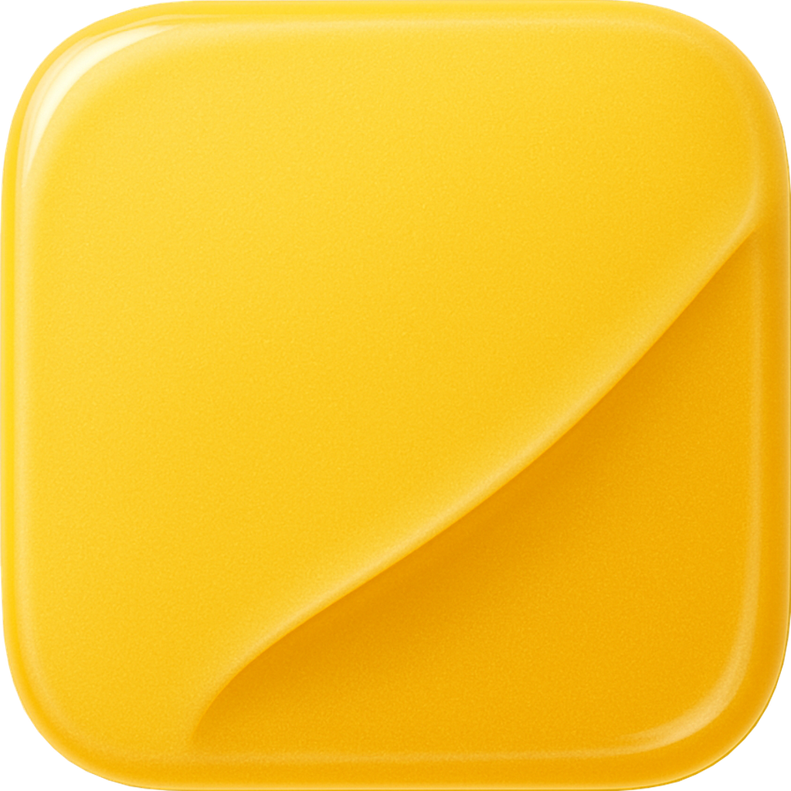

  

# HabitHonker

A clean and friendly habit & task tracker to keep you consistent, organized, and motivated.   

---

### 🛠 Tech Stack
- SwiftUI
- Combine
- SwiftData
- Local Notifications 
...

---

### 📌 Features
✅ Track daily habits and one-time tasks

📊 Visualize your progress over time

🗂 Prioritize with a simple and intuitive interface

🎯 Stay motivated and build long-term consistency

---

### 📸 Screenshots

  
  
  
  

---

### 🚀 Getting Started
Build & run on your iOS device or simulator.

**Requirements:**

Requirements:
Xcode 26
iOS 26

---

### 🤝 Contributing
This project is primarily developed and maintained by **Vladyslav Gubanov** as part of a personal portfolio and ongoing exploration of modern iOS development practices.  

While the main focus is on learning, experimentation, and showcasing clean architecture, I am open to:
- Suggestions for improving performance, maintainability, or user experience  
- Discussions around architecture and design decisions  
- Pull requests with thoughtful improvements or modern best practices  

Community contributions are not the primary goal, but constructive feedback and collaboration are always welcome.  

---

### ❓ Questions
If you have questions about any aspect of this project, please feel free to open an issue. I'd love to hear from you!  

---

### 📄 License
MIT License — see [LICENSE](LICENSE) for details.
